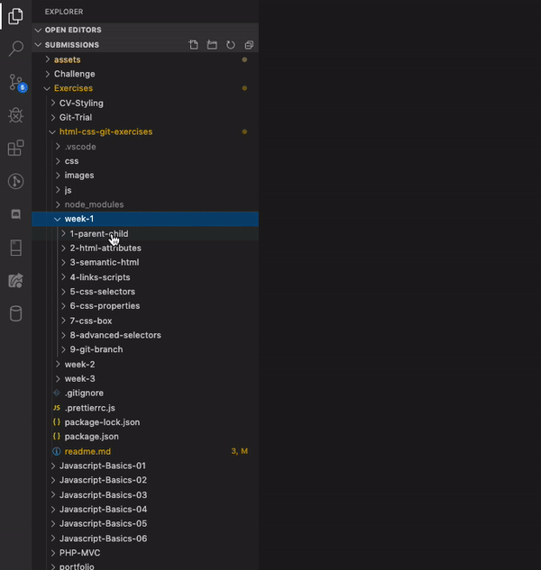

# HTML, CSS and Git exercises

A big thanks to Code Your Future.

---

## Set up the project

Before you can start the exercises, you must install all of the code necessary to run the exercises. Open the Terminal and run the following command.

```
npm install
```

Carefully read the messages that appear. Are there any errors? If so, please ask a mentor for help.

## Begin working on the exercises

To work on the first exercise, run the following command in the Terminal.

```
npm run 1
```

This will launch the sample website for the first exercise in your browser.

Now go back to your code editor. Open the first exercise in the `week-1` directory and find the `readme.md` file.



Read the instructions in the file you just opened. Follow the steps to complete the exercise.

## Completing more exercises

When you have finished the first exercise, you can begin the next one. To do this, go to the Terminal and type `CTRL`+`C` to stop running the first exercise.

To run another exercise, run the following code with the correct number of that exercise:

```
npm run 2
```
